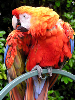
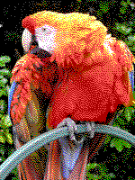
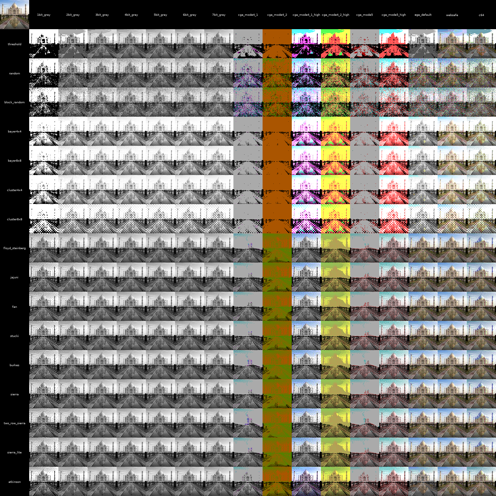

# dither.py

dither.py is a simple library I wrote to implement various dithering
algorithms as a learning exercise. The following algorithms are currently
implemented:

* **Threshold** - basic per-pixel quantization
* **Ordered Dithering** - quantization based on matrix templates
    * Bayer 4x4
    * Bayer 8x8
    * Cluster 4x4
    * Cluster 8x8
* **Error Diffusion** - adaptive forward quantization
    * Floyd-Steinberg
    * JaJuNi
    * Fan
    * Stucki
    * Burkes
    * Sierra
    * Sierra-2
    * Sierra Lite
    * Atkinson
* **Randomized** - randomized quantization
    * Per-pixel random
    * Block random

Several palettes are also available:

* Grayscale
    * 1-bit (black and white) through 7-bit (128 level)
* Gamma-corrected Commodore 64 (without the color limitation of either HiRes or MultiColor modes)
* CGA (using the RGBI monitor brown color)
    * Mode 4, low intensity
        * Palette 1
        * Palette 2
    * Mode 4, high intensity
        * Palette 1
        * Palette 2
    * Mode 5, low intensity
    * Mode 5, high intensity
* EGA
* Websafe (most common 6-bit variant)

Use `dither.py` to dither an input image with a given palette:

```
python dither.py -m floyd_steinberg -p ega images/parrot.jpg
```

 

or use the `-a` flag to create a collage with all combinations of methods and palettes:


